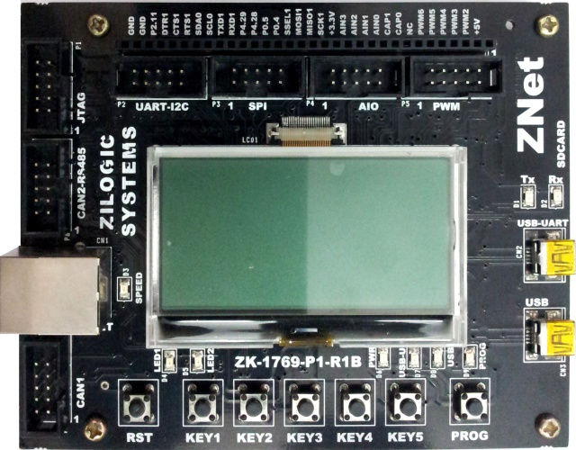

.. _zkit-arm-1769:

ZKit-ARM-1769, ARM Development Board
#####################################

Overview
********

The ZKit-ARM-1769, ARM Development Kit features an ARM Cortex-M3 based LPC1769 MCU
with a wide range of connectivity support and configurations. Here are
some highlights of the ZKit-ARM-1769 board:

- NXP LPC1769 micro-controller with 512KB Flash and 64KB RAM
- 120MHz ARM CPU
- Networking Interfaces:

       - 10/100Mbps Ethernet Interface
       - Two Channel CAN Bus Interface (2.0 B)
       - RS-485 Bus Interface
       - UART Interfaces (TTL and USB-Serial)
- Device Interface:

       - USB 2.0 Device Interface
       - SPI Interface
       - I2C Interface
- Storage:

       - microSD Connector
       - 512KB on-chip Flash
       - 2K I2C EEPROM
- Analog Interface:

       - ADC, 12-bit, 4 channels
       - DAC, 10-bit, 1 channel
       - PWM, 5 channels
- User Interface:

       - 128x64 graphics LCD, with backlight
       - Five button keypad
       - 2 debug LEDs
- Flashing/Debugging Interface:

       - UART serial console
       - JTAG

More information about the board can be found at,
      - `Product Page`_
      - `LPC1769 User Manual`_
      - `ZKit-ARM-1769 Schematics`_
      - `ZKit-ARM-1769 User Manual`_

Supported Features
==================

The Zephyr ZKit-ARM-1769 board configuration supports the following hardware features:

+-----------+------------+-------------------------------------+
| Interface | Controller | Driver/Component                    |
+===========+============+=====================================+
| NVIC      | on-chip    | nested vector interrupt controller  |
+-----------+------------+-------------------------------------+
| UART      | on-chip    | serial port-polling;                |
+-----------+------------+-------------------------------------+
| PINMUX    | on-chip    | pinmux                              |
+-----------+------------+-------------------------------------+
| CLOCK     | on-chip    | clock                               |
+-----------+------------+-------------------------------------+
| GPIO      | on-chip    | gpio                                |
+-----------+------------+-------------------------------------+
| SPI       | on-chip    | spi                                 |
+-----------+------------+-------------------------------------+

Other hardware features are not yet supported on Zephyr.

The default configuration can be found in the defconfig file:

	``boards/arm/zkit_arm_1769/zkit_arm_1769_defconfig``

Pin Mapping
===========

The ZKit-ARM-1769, ARM Development Kit has pinmux and gpio
controllers, which is responsible for pin muxing, input/output, pull-up,
etc.

For mode details please refer to `ZKit-ARM-1769 User Manual`_.

System Clock
============

The ZKit-ARM-1769 System Clock can choose between internal or external oscillator,
through a main PLL clock. By default the system clock is driven by the PLL clock at 120MHz,
driven by an 12MHz high speed external clock.

Serial Port
===========

The ZKit-ARM-1769, ARM Development Kit has up to 4 UARTs. The Zephyr console output is assigned to UART1.
The default communication settings are 115200 8N1.

Programming and Debugging
*************************

Applications for the ``zkit-arm-1769`` board configuration can be built
and flashed in the usual way (see :ref:`build_an_application` and
:ref:`application_run` for more details).

Flashing
========

The ZKit-ARM-1769, ARM Development Kit includes a ISP interface.

Flashing an application to ZKit-ARM-1769
-------------------------------------------

First, connect the ZKit-ARM-1769, ARM Development Kit to your host computer using
the USB port to prepare it for flashing. Then build and flash your application.

Here is an example for the :ref:`hello_world` application.

.. zephyr-app-commands::
   :zephyr-app: samples/hello_world
   :board: zkit_arm_1769
   :goals: build flash

Run a serial host program to connect with your board:

.. code-block:: console

   $ minicom -D /dev/ttyUSB0 -b 115200

Then, press the RESET button (The black one), you should see the following message:

.. code-block:: console

   Hello World! arm

.. _Product Page:
   http://www.zilogic.com/blog/product-zkit-arm-1769.html

.. _ZKit-ARM-1769 User Manual:
   http://www.zilogic.com/releases/current/zkit-arm-1769-user-manual.pdf

.. _ZKit-ARM-1769 Schematics:
   http://www.zilogic.com/releases/current/zkit-arm-1769-p1-r1b-schematic.pdf

.. _LPC1769 User Manual:
   https://www.nxp.com/docs/en/user-guide/UM10360.pdf
